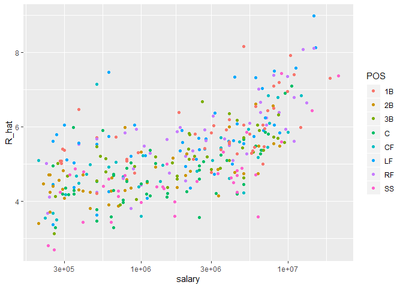

Selecting the Oakland Athletics baseball team for 2002
================
Sagar A
9/19/2020

## Making the Oakland Athletics team given player stats and a budget

Oakland Athletics needs to select a team in 2002 without a large budget.

In this document, I have made a summary of tall the steps I learnt in
the HarvardX course by Dr. Irizarry to be able to make that final team
with descriptions of all the functions used and detailed explanations of
all the steps. I highly reccomend this course to anyone who wants to
understand linear regression and the entire series to any aspiring data
scientist.

In baseball, the aim of the game is to score runs (points). Points can
be made in many ways. If the player gets to the first base a quarter
point is awarded and it is called a single. Similary for doubles and
triples. If a player makes all 4 bases and returns to the home plate, it
is called a home run and a full point is awarded. In the case of a
mis-throw, one quarter run is automatically awarded. This is called
Bases-on-balls.

These statistics are recorded for all teams and players in the Lahman
library.

Using these statistics, we will use Multiple Linear Regression to
predict runs based on team statistics and use the model to predict runs
by player.

We use pipes and graphics using ggplot2 so we need to load the tidyverse
package.

``` r
library(tidyverse, warn.conflicts = FALSE)
```

    ## Warning: package 'tidyverse' was built under R version 3.6.3

    ## -- Attaching packages -------------------------------- tidyverse 1.3.0 --

    ## v ggplot2 3.2.1     v purrr   0.3.4
    ## v tibble  3.0.3     v dplyr   1.0.0
    ## v tidyr   1.1.0     v stringr 1.4.0
    ## v readr   1.3.1     v forcats 0.4.0

    ## Warning: package 'tibble' was built under R version 3.6.3

    ## Warning: package 'tidyr' was built under R version 3.6.3

    ## Warning: package 'purrr' was built under R version 3.6.3

    ## Warning: package 'dplyr' was built under R version 3.6.3

    ## -- Conflicts ----------------------------------- tidyverse_conflicts() --
    ## x dplyr::filter() masks stats::filter()
    ## x dplyr::lag()    masks stats::lag()

# Step 1: Team statistics:

Runs win games. To find the relative importance of the parameters we
discussed, we need to make a model based on them.

Here, we will create a linear regression model. In R, this is done by
the lm function and returns an lm object. This is what we call our
model.

To do this, we are assuming here that BB, Single, doubles, triples and
HR are JOINTLY normal. i.e if we vary one of them keeping the others
constant the realtionship with the outcome (runs) is linear. This is a
precondition for making a linear model.Proving this requires stratifying
the other variables keeping each constant in turn but we don’t do this
here.

We firstly take the teams from 1961-2001. We need to make descisions
about the 2002 team using data from the previous years.

``` r
library(Lahman)
```

    ## Warning: package 'Lahman' was built under R version 3.6.3

``` r
fit <- Teams %>% 
  filter(yearID %in% 1961:2001) %>% 
  mutate(BB = BB / G, 
         singles = (H - X2B - X3B - HR) / G, 
         doubles = X2B / G, 
         triples = X3B / G, 
         HR = HR / G,
         R = R / G) %>%  
  lm(R ~ BB + singles + doubles + triples + HR, data = .)
```

The variable fit now has the lm object which constitutes our model. Lets
check whats in the lm object ‘fit’, that we created.

``` r
fit
```

    ## 
    ## Call:
    ## lm(formula = R ~ BB + singles + doubles + triples + HR, data = .)
    ## 
    ## Coefficients:
    ## (Intercept)           BB      singles      doubles      triples  
    ##     -2.7692       0.3712       0.5194       0.7711       1.2400  
    ##          HR  
    ##      1.4434

The output of lm is not a table with variable with multiple
observations. (It is not tidy). It also doesn’t display importatn
aspects about our model including the confidence intervals

To know more about our model, we can use the tidy function which is a
part of the broom package.

``` r
library(broom)
```

    ## Warning: package 'broom' was built under R version 3.6.3

``` r
coefs <- tidy(fit, conf.int = T)

coefs
```

    ## # A tibble: 6 x 7
    ##   term        estimate std.error statistic   p.value conf.low conf.high
    ##   <chr>          <dbl>     <dbl>     <dbl>     <dbl>    <dbl>     <dbl>
    ## 1 (Intercept)   -2.77     0.0862     -32.1 4.76e-157   -2.94     -2.60 
    ## 2 BB             0.371    0.0117      31.6 1.87e-153    0.348     0.394
    ## 3 singles        0.519    0.0127      40.8 8.67e-217    0.494     0.544
    ## 4 doubles        0.771    0.0226      34.1 8.44e-171    0.727     0.816
    ## 5 triples        1.24     0.0768      16.1 2.12e- 52    1.09      1.39 
    ## 6 HR             1.44     0.0243      59.3 0.           1.40      1.49

``` r
# So our formula for is :
# -2.77 + 0.371 x BB + 0.519 x Singles + 0.771 x doubles...
```

The coefficients for the run scoring ability is listed in the summary of
our model under the column ‘estimate’.

These coefficients which are calculated by R are the least sqquare
estimates of the Betas (coefficients) of the linear regression
equation:

\[\ Y_i = \beta_0 + \beta_1 X_i + \beta_2 X_i + \beta_3 X_i + \beta_3 X_i + \beta_43 X_i + \epsilon_i\]

By adding the Intercept and multiplying each of the parameters by the
estimate, we can predict the number of runs.

Thanks to the tidy function, we also have the confidence intervals of
our prediction.

In the next piece of code, we try to see how well our model holds up
compared to the real results of 2002

# Step 2: Check the model by predicting runs for 2002.

``` r
Teams %>% 
  filter(yearID %in% 2002) %>%
  mutate(BB = BB / G, 
         singles = (H - X2B - X3B - HR) / G, 
         doubles = X2B / G, 
         triples = X3B / G, 
         HR = HR / G,
         R = R / G) %>%
  mutate(R_hat = predict(fit, newdata = .))%>%
  ggplot(aes(R_hat,R,label = teamID))+
  geom_point()+
  geom_text(nudge_x = 0.1,cex=2)+
  geom_abline()
```

<!-- -->

The points are all close to the line\! Our model is good at predicting
runs given the BB, singles, doubles, triples and HR from previous
periods.

This is at a team level though and our stated aim is to select players,
not to predict team victories.

To select players for our team, we need to take into account that
players can only score runs if they have a chance to bat. We call these
chances plate appearances. We need to know plate appearances per player
to apply the model to players themselves.First we will calculate avg
plate appearances per team. The following code calcuates the average
plate appearances of all teams in 2001.

# Step 3 : Preparation to apply our model to players

``` r
Batting %>% filter(yearID == 2001) %>% 
  group_by(teamID)%>%
  summarise(pa_per_game = sum(AB+BB)/max(G)) %>%
  .$pa_per_game %>%
  mean() -> pa_per_game
```

    ## `summarise()` ungrouping output (override with `.groups` argument)

Now we will compute the per-plate appearance for players available and
use our lm object fit with the predict() fn to to predict number of runs
if the team were comprised of clones of only that same player.

``` r
players <- Batting %>% filter(yearID %in% 1999:2001) %>% 
  group_by(playerID)%>%
  mutate(PA = BB + AB)%>%
  summarize(G = sum(PA)/pa_per_game,
            BB = sum(BB)/G,
            singles = sum(H-X2B-X3B-HR)/G,
            doubles = sum(X2B)/G, 
            triples = sum(X3B)/G, 
            HR = sum(HR)/G,
            AVG = sum(H)/sum(AB),
            PA = sum(PA)) %>% 
  filter(PA >= 300) %>%
  select(-G)%>%
  mutate(R_hat = predict(fit,newdata = .))
```

    ## `summarise()` ungrouping output (override with `.groups` argument)

## Plot player-specific predicted runs

``` r
qplot(R_hat, data = players, geom = "histogram", binwidth = 0.5, color = I("black"))
```

<!-- -->

Oakland athletics has a limited budget. An important parameter of our
selection model is thus, the salary of the player. In the next piece of
code, we add that.

## Add 2002 salary of each player

``` r
players <- Salaries %>% 
  filter(yearID == 2002) %>%
  select(playerID, salary) %>%
  right_join(players, by="playerID")
```

To make a team, we need players of each playing position. We can’t just
take run scorers if they don’t have fielding skills. In the next peice
of code, we add a player position to the player. However, a player might
play in multiple positions through his career. We avois that complexity
by choosing the maximum played at position. We are on a budget, we’d
better take sure
bets.

## Add defensive position

``` r
position_names <- c("G_p","G_c","G_1b","G_2b","G_3b","G_ss","G_lf","G_cf","G_rf")
tmp_tab <- Appearances %>% 
  filter(yearID == 2002) %>% 
  group_by(playerID) %>%
  summarize_at(position_names, sum) %>%
  ungroup()  
```

If there is a tie, we take first row

``` r
pos <- tmp_tab %>%
  select(position_names) %>%
  apply(., 1, which.max) 
```

    ## Note: Using an external vector in selections is ambiguous.
    ## i Use `all_of(position_names)` instead of `position_names` to silence this message.
    ## i See <https://tidyselect.r-lib.org/reference/faq-external-vector.html>.
    ## This message is displayed once per session.

``` r
players <- data_frame(playerID = tmp_tab$playerID, POS = position_names[pos]) %>%
  mutate(POS = str_to_upper(str_remove(POS, "G_"))) %>%
  filter(POS != "P") %>%
  right_join(players, by="playerID") %>%
  filter(!is.na(POS)  & !is.na(salary))
```

    ## Warning: `data_frame()` is deprecated as of tibble 1.1.0.
    ## Please use `tibble()` instead.
    ## This warning is displayed once every 8 hours.
    ## Call `lifecycle::last_warnings()` to see where this warning was generated.

Next, we add players’ first and last names.

``` r
players <- Master %>%
  select(playerID, nameFirst, nameLast, debut) %>%
  mutate(debut = as.Date(debut)) %>%
  right_join(players, by="playerID")
```

Here, we check top 10 players to see their salaries.

``` r
players %>% select(nameFirst, nameLast, POS, salary, R_hat) %>% 
  arrange(desc(R_hat)) %>% 
  top_n(10) 
```

    ## Selecting by R_hat

    ##    nameFirst    nameLast POS   salary    R_hat
    ## 1      Barry       Bonds  LF 15000000 8.975750
    ## 2       Todd      Helton  1B  5000000 8.156752
    ## 3      Manny     Ramirez  LF 15462727 8.128305
    ## 4      Sammy        Sosa  RF 15000000 8.114241
    ## 5      Larry      Walker  RF 12666667 8.075902
    ## 6      Jason      Giambi  1B 10428571 7.923960
    ## 7    Chipper       Jones  LF 11333333 7.573236
    ## 8      Brian       Giles  LF  8063003 7.505129
    ## 9     Albert      Pujols  LF   600000 7.469579
    ## 10     Nomar Garciaparra  SS  9000000 7.438399

No top 10 player has a low salary.Lets plot all players based on their
expected run scoring and salary.

There are some in the top left\! Unfortunately, players in left top
cornerare often those who are young and just signed a long term contract
and hence aren’t available for us to sign on.

``` r
players %>% ggplot(aes(salary, R_hat, color = POS)) + 
  geom_point() +
  scale_x_log10()
```

<!-- -->

We filter out those players as we can’t sign them on.

``` r
# remake plot without players that debuted after 1998
library(lubridate)
```

    ## 
    ## Attaching package: 'lubridate'

    ## The following object is masked from 'package:base':
    ## 
    ##     date

``` r
players %>% filter(year(debut) < 1998) %>%
  ggplot(aes(salary, R_hat, color = POS)) + 
  geom_point() +
  scale_x_log10()
```

<!-- -->

# Step 4 : Use linear programming to select a 8 players minimizing salary and maximizing runs

For selecting the best players from the group available to us, we use
linear programming. We select only 8 as one player doesn’t bat so using
predicted rruns to select him wouldn’t be clever. Remeber we want our
Salary to be lower than 50 MUSD.

``` r
library(reshape2)
```

    ## 
    ## Attaching package: 'reshape2'

    ## The following object is masked from 'package:tidyr':
    ## 
    ##     smiths

``` r
library(lpSolve)
```

    ## Warning: package 'lpSolve' was built under R version 3.6.2

``` r
players <- players %>% filter(debut <= "1997-01-01" & debut > "1988-01-01")
constraint_matrix <- acast(players, POS ~ playerID, fun.aggregate = length)
```

    ## Using R_hat as value column: use value.var to override.

``` r
npos <- nrow(constraint_matrix)
constraint_matrix <- rbind(constraint_matrix, salary = players$salary)
constraint_dir <- c(rep("==", npos), "<=")
constraint_limit <- c(rep(1, npos), 50*10^6)
lp_solution <- lp("max", players$R_hat,
                  constraint_matrix, constraint_dir, constraint_limit,
                  all.int = TRUE) 
```

The algorithm chose the following 9 players.

``` r
our_team <- players %>%
  filter(lp_solution$solution == 1) %>%
  arrange(desc(R_hat))
our_team %>% select(nameFirst, nameLast, POS, salary, R_hat)
```

    ##   nameFirst    nameLast POS   salary    R_hat
    ## 1     Larry      Walker  RF 12666667 8.075902
    ## 2     Nomar Garciaparra  SS  9000000 7.438399
    ## 3      Luis    Gonzalez  LF  4333333 7.331123
    ## 4      Mike      Piazza   C 10571429 7.096532
    ## 5       Jim     Edmonds  CF  7333333 6.835867
    ## 6      Phil       Nevin  3B  2600000 6.683395
    ## 7      Greg    Colbrunn  1B  1800000 6.378528
    ## 8     Terry    Shumpert  2B   775000 5.987674

Their combined salary is less than 50 MUSD.

``` r
our_team <- players %>%
  filter(lp_solution$solution == 1) %>%
  arrange(desc(R_hat))
our_team %>% select(nameFirst, nameLast, POS, salary, R_hat)
```

    ##   nameFirst    nameLast POS   salary    R_hat
    ## 1     Larry      Walker  RF 12666667 8.075902
    ## 2     Nomar Garciaparra  SS  9000000 7.438399
    ## 3      Luis    Gonzalez  LF  4333333 7.331123
    ## 4      Mike      Piazza   C 10571429 7.096532
    ## 5       Jim     Edmonds  CF  7333333 6.835867
    ## 6      Phil       Nevin  3B  2600000 6.683395
    ## 7      Greg    Colbrunn  1B  1800000 6.378528
    ## 8     Terry    Shumpert  2B   775000 5.987674

lets look closely at their stats. The mad() function calculates the
median absolute deviation letting us see who our model headhunted. We
see that our players have above average rates for BB and HR suggesting
that Salaries at this point had not adequately taken these parameters
into account.

``` r
my_scale <- function(x) (x - median(x))/mad(x)
players %>% mutate(BB = my_scale(BB), 
                   singles = my_scale(singles),
                   doubles = my_scale(doubles),
                   triples = my_scale(triples),
                   HR = my_scale(HR),
                   AVG = my_scale(AVG),
                   R_hat = my_scale(R_hat)) %>%
    filter(playerID %in% our_team$playerID) %>%
    select(nameFirst, nameLast, BB, singles, doubles, triples, HR, AVG, R_hat) %>%
    arrange(desc(R_hat))
```

    ##   nameFirst    nameLast          BB     singles    doubles    triples
    ## 1     Larry      Walker  1.06046632  0.65537604  0.9222382  1.5623740
    ## 2     Nomar Garciaparra  0.02740822  1.63711529  3.1180186  0.3360131
    ## 3      Luis    Gonzalez  0.70462683  0.00000000  1.4130409  0.5372768
    ## 4      Mike      Piazza  0.31291096 -0.05467554 -0.2423260 -1.2744279
    ## 5       Jim     Edmonds  1.80740051 -1.14093605  0.6744908 -0.6744908
    ## 6      Phil       Nevin  0.49093751 -0.64789374  0.7639165 -1.0981114
    ## 7      Greg    Colbrunn  0.27030518  0.65458272  0.7842985  0.5852173
    ## 8     Terry    Shumpert -0.15757676  0.12209840  1.3257086  3.9081446
    ##           HR       AVG     R_hat
    ## 1  1.5655295 2.8353966 2.9036338
    ## 2  0.6245544 3.1968196 2.2442192
    ## 3  1.3546270 1.8287077 2.1332555
    ## 4  2.0347431 1.2518167 1.8906021
    ## 5  1.2636708 0.5794012 1.6209774
    ## 6  1.5479606 0.7282880 1.4632640
    ## 7  0.4747056 1.3745471 1.1479184
    ## 8 -0.1227625 0.8594304 0.7436304
